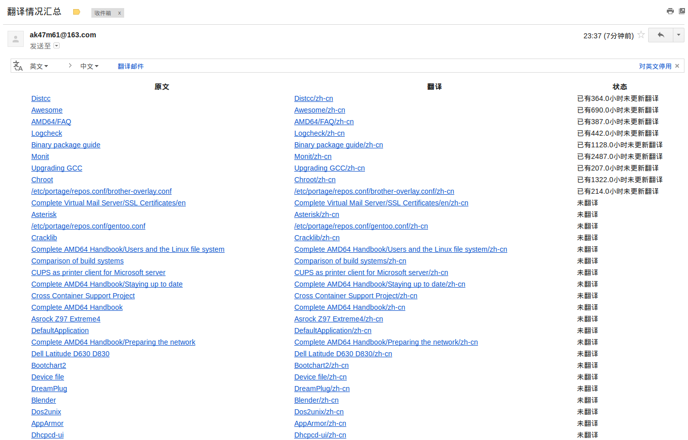

# WikiTranslationBot
A wiki bot to analyze the translation status of wiki WebSite,Use mwclient to call [Mediawiki](https://www.mediawiki.org/wiki/MediaWiki) API.
一个统计分析wiki类翻译状态的的机器人,使用mwclient来调用Mediawiki的API。

##邮件效果

##使用说明
1. 安装：
```
python setup.py install
```
如果gevent安装失败，请安装python-dev：`apt-get install python-dev`

2. 使用：
`Spider config.json`

3. 配置文件说明：
```json
{
  "protocol": "https", #wiki站点使用的是https还是http
  "URL": "wiki.gentoo.org", #wiki站点URL
  "path": "/", #api.php位置，例如gentoo就在https://wiki.gentoo.org/api.php
  "OriginLang": "en",  # 源语言
  "TranslateLang": "zh-cn", #要翻译的语言
  "translateme": "Translateme (简体中文)", # 一些特殊的用于标记翻译情况的模版，可选。
  "suffix": "/zh-cn", #后缀，例如Distcc的中文翻译在Distcc/zh-cn
  "route": "/wiki/", #路由，网站URL和page的中间部分，例如https://wiki.gentoo.org/wiki/Distcc/zh-cn的/wiki/
  "mhost": "smtp.163.com", # wikiSpider邮箱服务器
  "muser": "FFFF@163.com", #wikiSpider 用户名
  "mport": 587, # WikiSpider邮件服务器地址
  "mpasswd": "FFF",#邮箱密码
  "subject": "翻译情况汇总", #邮件主题
  "sender": "Wikibot", # 发件人姓名
  "receivers": [
    "ak47m61@gmail.com" #收件人列表
  ]
}
```

4. 继承拓展
见ArchSpider.py和arch.json


##TODO
1. ~简单的log~ 
2. 内存占用
~打算改用gevent.pool。~
3. 按指定Catelogy获取待翻译页面。
api通过catelogy获取的结果中有点的还是Catelogy，比较复杂的递归关系，放弃。
4. 邮件功能增强
5. 代码规范
6. 更加美观的汇总页面（前端苦手TAT）

##新分支on_text解决内存占用，并且按时间排序问题。
